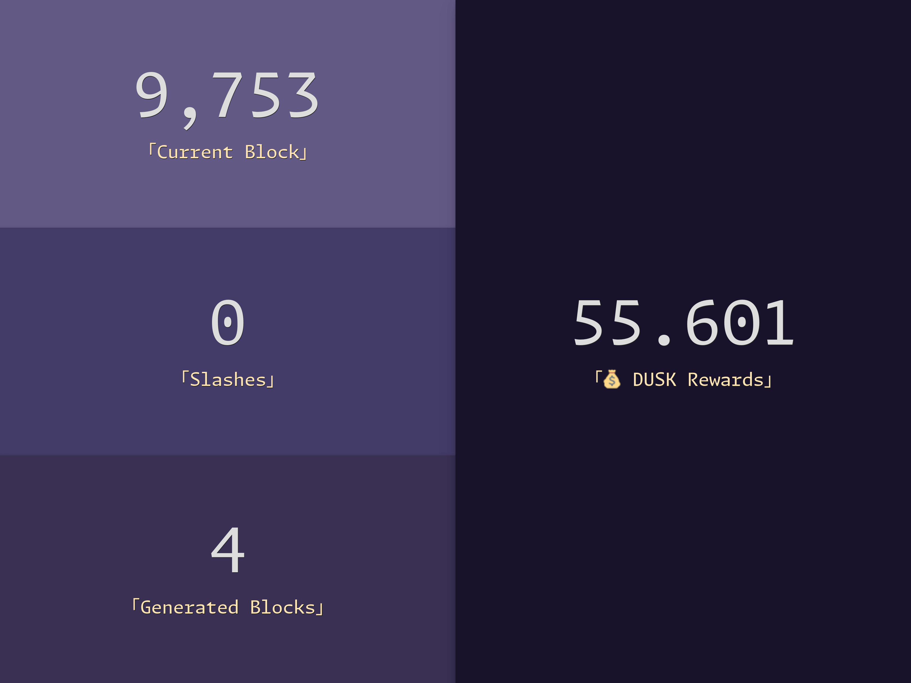
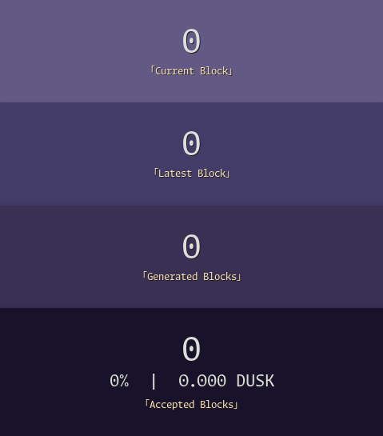

# Dusk Node Monitoring

Dumb'n simple tool to sync & display Dusk node metrics (see the outdated [preview](#preview)).
It is all about blocks, nothing more.

> [!IMPORTANT]
> Any help is welcome in order to find an efficient GraphQL query to fetch accepted blocks from a given provisioner.
> See the current query in the [constants.py](app/constants.py) file (look for the `GENERATED_BLOCKS_GRAPHQL_QUERY` variable).

## Install

```bash
python3 -m venv venv
. ./venv/bin/activate
python -m pip install -U pip
python -m pip install -r requirements.txt
```

## Setup

```bash
echo 'PROVISIONER_PUBLIC_KEY' > provisioner.txt
```

### Node

On the node, execute this script to append shell functions into the user profile file:

```bash
cat << 'EOF' >> ~/.profile

# Dusk Monitoring (https://github.com/BoboTiG/dusk-monitor)

function get_node_infos() {
    local current_block="$(ruskquery block-height)"
    local latest_block="$(API_ENDPOINT=https://nodes.dusk.network ruskquery block-height)"
    local stake_info="$(stake-info 2>/dev/null)"
    local soft_slashes="$(echo "${stake_info}"| grep -E '^Slashes' | awk '{print $2}')"
    local hard_slashes="$(echo "${stake_info}"| grep -E '^Hard Slashes' | awk '{print $3}')"
    echo "${current_block} ${latest_block} ${soft_slashes} ${hard_slashes}"
}
EOF
```

There are also two assumptions:
- The SSH connection to the node is made via key (and not a password).
- There is a defined custom SSH `HostName` to connect to the node (`dusk` by default, and it can be tweaked by setting the `DUSK_SSH_HOSTNAME` environment variable).

Here is a sample `~/.ssh/config` file to see what I mean:

```bash
Host dusk
    User USER
    HostName IP
    PreferredAuthentications publickey
```

The app will issue commands like `ssh DUSK_SSH_HOSTNAME "source .profile ; COMMAND"` (where `COMMAND` will be one of the functions defined above, nothing more ; and you can inspect the source code to double-check).

## Run

### Update Data

Update data on a regular basis (to be done via a cron job, ensure to read notes in [constants.py](app/constants.py) about the `LAST_BLOCKS_COUNT` environment variable):

```bash
python -m app --update
```

Example of such a cron job that runs every hour:

```bash
0 * * * * cd /path/to/dusk-monitor && ./venv/bin/python -m app --update
```

### Web Server

Start the local web server at [http://localhost:1923](http://localhost:1923):

```bash
python -m app
```

## Test

> If you test, you're a coward.

> Si tu testes, t’es un lâche.

## Preview

On desktop:



On smartphone:


