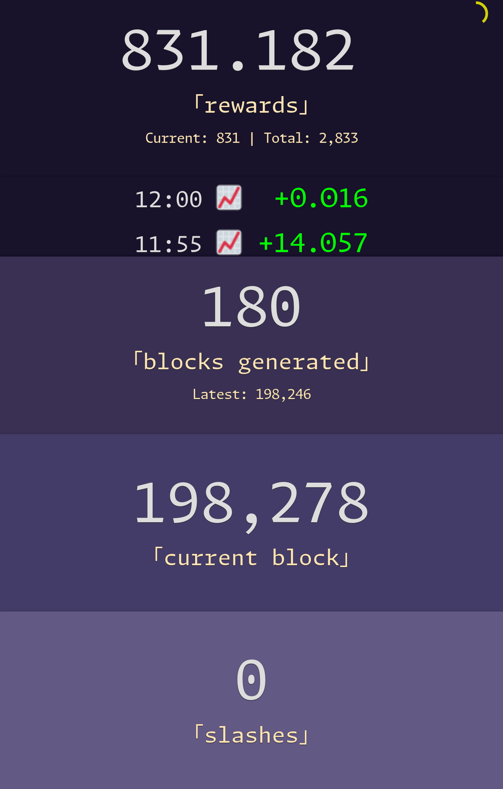

# Dusk Node Monitoring

A minimalist dashboard for your Dusk node (go to the [preview](#preview), and check [similar projects](#similar-projects)). Here is [how to setup a node, in French](https://www.tiger-222.fr/luma/blockchain/node-dusk.html).

So far, we display:
- The current synchronized block (in red + a warning sign when behind the latest block).
- The slash count (in red + a warning sign when they happen).
- The generated blocks count.
- The current rewards value (+ a theoric total rewards accumulated so far).

🔔 A nice sound will be played on new generated block, and this is totally optional. You can disable it by setting the `PLAY_SOUND=0` environment variable.

> [!TIP]
> Dusk wallet for tips:
> ```
> VKZpBrNtEeTobMgYkkdcGiZn8fK2Ve2yez429yRXrH4nUUDTuvr7Tv74xFA2DKNVegtF6jaom2uacZMm8Z2Lg2J
> ```

## Install

```bash
python3 -m venv venv
. ./venv/bin/activate
python -m pip install -r requirements.txt
```

## Setup

```bash
echo 'PROVISIONER_PUBLIC_KEY' > provisioner.txt
```

### Node

On the node, execute this script to append one shell function into the user profile file:

```bash
cat << 'EOF' >> ~/.profile

function get_node_info() {
    # Dusk Monitoring (https://github.com/BoboTiG/dusk-monitor)
    local current_block="$(ruskquery block-height)"
    local latest_block="$(API_ENDPOINT=https://nodes.dusk.network ruskquery block-height)"
    local stake_info="$(rusk-wallet stake-info 2>/dev/null)"
    local soft_slashes="$(echo "${stake_info}"| grep -E '^Slashes' | awk '{print $2}')"
    local hard_slashes="$(echo "${stake_info}"| grep -E '^Hard Slashes' | awk '{print $3}')"
    echo "${current_block} ${latest_block:-0} ${soft_slashes} ${hard_slashes}"
}
EOF
```

There are assumptions:
1. The SSH connection to the node is made via key (and not a password).
2. There is a defined custom SSH `HostName` to connect to the node (`dusk` by default, and it can be tweaked by setting the `DUSK_SSH_HOSTNAME` environment variable on the local machine).
3. The `rusk-wallet` environment variable is exported on the node (`export RUSK_WALLET_PWD='THE_PASSWORD'`).

Here is a sample `~/.ssh/config` file to see what I mean:

```bash
Host dusk
    User USER
    HostName IP
    PreferredAuthentications publickey
```

The app will issue that only one command as `ssh DUSK_SSH_HOSTNAME "source .profile ; get_node_info"` (nothing more, and you can inspect the source code to [double-check](https://github.com/search?q=repo:BoboTiG/dusk-monitor%20CMD_GET_NODE_INFO&type=code).

## Run

### Listen to Accepted Blocks

An efficient way to keep track of accepted blocks is to listen to the blockchain directly:

```bash
python -m app --listen
```

### Update Data

You can update data on a regular basis, it will scan the entire blockchain for blocks generated by the node:

```bash
python -m app --update
```

Example of such a cron job that runs every day:

```bash
0 0 * * * cd /path/to/dusk-monitor && ./venv/bin/python -m app --update
```

### Web Server

Start the local web server at [http://localhost:1923](http://localhost:1923):

```bash
python -m app
```

## Preview

> [!NOTE]
> Those screenshots might be outdated, but the essence of the dashboard is still relevant from those pictures.

On desktop:


On smartphone:



## Similar Projects

- [wolfrage76/DuskMan](https://github.com/wolfrage76/DuskMan/)
