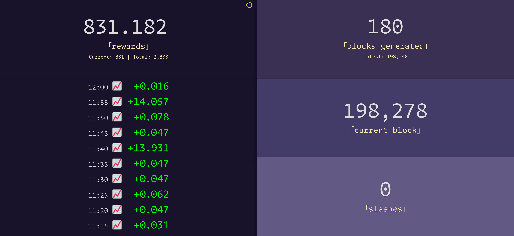

# Dusk Node Monitoring

A minimalist dashboard for your Dusk node (go to the [preview](#preview), and check [similar projects](#similar-projects)). Here is [how to set up a node, in French](https://www.tiger-222.fr/luma/blockchain/node-dusk.html).

> [!TIP]
> Dusk wallet for tips:
> ```
> VKZpBrNtEeTobMgYkkdcGiZn8fK2Ve2yez429yRXrH4nUUDTuvr7Tv74xFA2DKNVegtF6jaom2uacZMm8Z2Lg2J
> ```

## Install

```bash
python3 -m venv venv
. ./venv/bin/activate
python -m pip install -r requirements.txt
```

## Setup

> [!IMPORTANT]
> There are assumptions:
>
> 1. The SSH connection to the node is made via public key (and not a password).
> 2. There is a defined custom SSH `HostName` to connect to the node (`dusk` by default, and it can be tweaked by setting the `DUSK_SSH_HOSTNAME` environment variable).
>
> Here is a sample `~/.ssh/config` file to see what I mean:
>
> ```bash
> Host dusk
>     User USER
>     HostName IP
>     PreferredAuthentications publickey
> ```
>
> The app will issue that only one command as `ssh DUSK_SSH_HOSTNAME 'ruskquery block-height'` (nothing more, and you can inspect the source code to [double-check](https://github.com/search?q=repo:BoboTiG/dusk-monitor%20CMD_GET_NODE_SYNCED_BLOCK&type=code)).

#### Data

A JSON file (`db.json`) will be created, and updated, as a database-like container. Those `db.json`, and `provisioner.txt`, files are stored at the root of the repository by default. You can move them to another place, and set the `DATA_DIR` environment variable accordingly:

```bash
DATA_DIR=../dusk-monitor-data/node-1 COMMAND
```

You will then have that tree:

```bash
../dusk-monitor-data
└─── node-1
     ├── db.json
     └── provisioner.txt
```

#### The Provisioner File

```bash
echo 'PROVISIONER_PUBLIC_KEY' > "${DATA_DIR:-.}/provisioner.txt"
```

## Run

1. Set up the [provisioner file](#the-provisioner-file).
1. Set up the [cron job](#update-data).
1. Start the [web server](#web-server), keep it running as long as you want to have a visual on the dashboard.
1. That's it!

## Commands

### Update Data

You can update data on a regular basis.
The first time, it will scan the entire blockchain for blocks generated by the node, and subsequent calls will only fetch new blocks since the last run.

Here is the cron job to update data every 5 minutes:

```bash
*/5 * * * * cd /path/to/dusk-monitor && DATA_DIR=... ./venv/bin/python -m app --update
```

### Web Server

Start the local web server at [http://localhost:1923](http://localhost:1923):

```bash
DATA_DIR=... python -m app
```

## Preview

So far, we display:
- The current synchronized block (in red + a warning sign when behind the latest block).
- The slash count (in red + a warning sign when they happen).
- The generated blocks count.
- The current rewards value (+ an estimated total rewards accumulated so far).
- The history of the past hour.

🔔 A nice sound will be played on new generated block, and this is totally optional. You can disable it by setting the `PLAY_SOUND=0` environment variable.

> [!NOTE]
> Those screenshots might be outdated, but the essence of the dashboard is still relevant from those pictures.

On desktop:



On smartphone:


## Similar Projects

- [wolfrage76/DuskMan](https://github.com/wolfrage76/DuskMan/)
